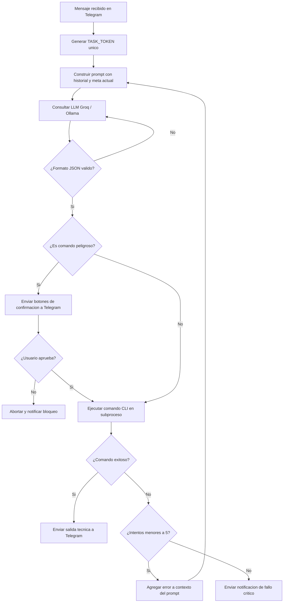

# Agente DevOps/SRE Autonomo (ChatOps)

Este proyecto implementa un agente autonomo de DevOps y Site Reliability Engineering (SRE) diseñado para interactuar mediante ChatOps a traves de un bot de Telegram. El agente procesa peticiones en lenguaje natural para administrar sistemas locales o remotos, utilizando modelos de lenguaje en la nube (mediante la API de Groq con el modelo llama-3.3-70b-versatile) o locales (mediante Ollama con el modelo llama3).

El sistema detecta de forma automatica el sistema operativo del anfitrion (Windows o Linux) y adapta la sintaxis de los comandos (PowerShell o Bash). Cuenta con un sistema de autorreparacion (Self-Healing) capaz de interpretar los errores de la terminal y ajustar sus instrucciones de manera iterativa, e implementa un mecanismo de aprobacion humana (Human-in-the-Loop) para evitar la ejecucion accidental de comandos peligrosos.

---

## Caracteristicas Principales

* **Control por ChatOps (Telegram)**: Permite administrar servidores de manera remota enviando ordenes en lenguaje natural.
* **Compatibilidad Multiplataforma**:
  * **Windows**: Ejecucion nativa en PowerShell. Utiliza codificacion cp1252 para prevenir errores con caracteres especiales (tildes, eñes) en la comunicacion con los subprocesos de Python.
  * **Linux/Unix**: Ejecucion nativa en Bash.
* **Soporte de Modelos Local y Nube**:
  * **Modo LOCAL**: Integracion con Ollama (http://localhost:11434) usando el modelo llama3 para ejecuciones privadas y offline.
  * **Modo CLOUD**: Integracion con Groq Cloud usando llama-3.3-70b-versatile para respuestas de baja latencia y alta precision.
* **Bucle de Autorreparacion (Self-Healing)**: Si un comando falla, el agente analiza la salida de error (stderr), reestructura el prompt e intenta enfoques alternativos de forma automatica (limite de 5 intentos).
* **Control de Seguridad (Human-in-the-Loop)**:
  * Clasificacion automatica de comandos en "seguros" (lectura/diagnostico) e "inseguros/peligrosos" (escritura/borrado/modificacion).
  * Los comandos clasificados como peligrosos se pausan y requieren autorizacion explicita del administrador en Telegram mediante botones interactivos (inline keyboard) respaldados por un identificador unico de sesion (TASK_TOKEN).
* **Monitorizacion de Metricas del Sistema**: Componente StatusChecker que lee configuraciones en JSON para auditar el estado del hardware y servicios docker, generando alertas inmediatas.

---

## Estructura del Proyecto

El codigo fuente esta organizado de la siguiente manera:

```text
devops-agent/
├── config/
│   ├── metrics_config.json     # Umbrales y comandos de monitoreo SRE
│   └── settings.py             # Carga y validacion de variables .env con Pydantic
├── src/
│   ├── tools/
│   │   ├── global_tools.py     # Ejecutor CLI nativo con subprocess y codificaciones seguras
│   │   └── status_checker.py   # Auditor periodico de metricas de hardware y Docker
│   ├── agent.py                # Interfaz con LLMs (Groq/Ollama) y diseño de prompts
│   ├── chatops.py              # Integracion con la API de Telegram y logica de aprobaciones
│   └── __init__.py
├── test/
│   └── test.txt                # Archivo para pruebas locales
├── .dockerignore
├── .env                        # Archivo de configuracion local (creado en la instalacion)
├── .gitignore
├── Dockerfile                  # Configuracion para la contenedorizacion del agente
├── docker-compose.yml          # Orquestacion de Docker con mapeo de socket
├── devops-agent.service        # Plantilla de servicio Systemd para Linux
├── env.example                 # Plantilla de referencia para variables de entorno
├── install.sh                  # Script de instalacion automatizada en Linux
├── main.py                     # Punto de entrada principal y bucle de eventos ChatOps
└── requirements.txt            # Dependencias del proyecto (Pydantic, python-dotenv, requests)
```

---

## Requisitos Previos

Antes de configurar y arrancar la aplicacion, es necesario disponer de:

1. **Bot de Telegram**:
   * Creado a traves del bot oficial de Telegram @BotFather, obteniendo el token de acceso (TELEGRAM_TOKEN).
   * Identificador de chat del administrador (CHAT_ID), obtenible mediante el bot @userinfobot. Solo los mensajes procedentes de este ID seran procesados por el agente.

2. **Modelo de Lenguaje (LLM)**:
   * **Para Modo Nube (CLOUD)**: Una clave de API valida de Groq Cloud (GROQ_KEY).
   * **Para Modo Local (LOCAL)**: Una instalacion activa de Ollama con el modelo llama3 ya descargado (ejecutando "ollama run llama3").

---

## Configuracion (.env)

El agente requiere de un archivo .env en la raiz del proyecto para inicializar sus variables de entorno. Puede crearse copiando el archivo env.example:

```env
IA_MODE=LOCAL
GROQ_KEY=tu_clave_api_groq
TELEGRAM_TOKEN=tu_token_de_telegram_bot
CHAT_ID=tu_id_de_usuario_telegram
```

La carga del archivo se realiza a traves de config/settings.py, el cual utiliza Pydantic para validar que todas las variables requeridas esten presentes y tengan un formato correcto. Si falta alguna variable obligatoria, el agente abortara el arranque y mostrara un reporte detallado del fallo de validacion.

---

## Metodos de Despliegue y Ejecucion

### Metodo 1: Instalacion como Servicio Systemd en Linux (Recomendado para Produccion)

Si se desea ejecutar el agente de forma continua en segundo plano dentro de un servidor Linux, se puede utilizar el script de instalacion automatica:

1. **Dar permisos de ejecucion y ejecutar el instalador**:
   ```bash
   sudo chmod +x install.sh
   sudo ./install.sh
   ```
   Este script creara el entorno virtual de Python (venv), instalara todas las dependencias requeridas (con control de compatibilidad para Python 3.13), generara una plantilla .env si no existe, y registrara el servicio devops-agent.service en Systemd.

2. **Administracion del Servicio**:
   * **Ver estado**: `sudo systemctl status devops-agent`
   * **Iniciar**: `sudo systemctl start devops-agent`
   * **Detener**: `sudo systemctl stop devops-agent`
   * **Reiniciar**: `sudo systemctl restart devops-agent`

3. **Lectura de Logs en Tiempo Real**:
   ```bash
   sudo journalctl -u devops-agent -f
   ```

---

### Metodo 2: Ejecucion en Contenedores con Docker Compose

El agente puede empaquetarse y ejecutarse en un entorno aislado pero con privilegios para monitorizar y controlar los demas contenedores de la maquina anfitriona.

1. **Configurar el archivo .env** con las credenciales necesarias.
2. **Construir y levantar el contenedor**:
   ```bash
   docker-compose up -d --build
   ```
   *Nota: El archivo docker-compose.yml mapea el socket de Docker del host (/var/run/docker.sock) al contenedor, permitiendo al agente ejecutar comandos de Docker como "docker restart" o "docker ps" directamente sobre el motor del anfitrion.*
3. **Ver logs de la ejecucion**:
   ```bash
   docker-compose logs -f devops-agent
   ```

---

### Metodo 3: Ejecucion Manual en Local (Desarrollo)

Ideal para realizar pruebas en entornos Windows o distribuciones de desarrollo de Linux.

1. **Crear y activar el entorno virtual de Python**:
   * **En Windows (PowerShell)**:
     ```powershell
     python -m venv venv
     .\venv\Scripts\Activate.ps1
     ```
   * **En Linux/macOS**:
     ```bash
     python3 -m venv venv
     source venv/bin/activate
     ```

2. **Instalar dependencias**:
   ```bash
   pip install -r requirements.txt
   ```

3. **Iniciar la aplicacion**:
   ```bash
   python main.py
   ```

---

## Flujo de Trabajo y Logica Interna

### Diagrama de Ejecucion del Agente

El siguiente diagrama detalla la logica de toma de decisiones y ejecucion del agente desde que recibe un mensaje hasta que devuelve la respuesta o inicia el bucle de autorreparacion:



### Mecanismos de Seguridad y Clasificacion de Comandos

El agente analiza semanticamente cada instruccion que propone ejecutar y la clasifica en base al riesgo:

1. **Comandos Pasivos (Seguros)**: Comandos de lectura o diagnostico (por ejemplo: `df -h`, `free -m`, `docker ps`, `ls`). Tienen la propiedad `"peligro": false` y se ejecutan inmediatamente.
2. **Comandos Activos (Peligrosos)**: Comandos que modifican el sistema, crean archivos, detienen servicios o eliminan directorios (por ejemplo: `rm -rf`, `docker restart`, `mkdir`, `touch`). Tienen la propiedad `"peligro": true`.
   * Al detectarse, se suspende la ejecucion de la tarea.
   * Se envia un mensaje interactivo de confirmacion a Telegram con los botones "Confirmar (SI)" y "Cancelar (NO)".
   * El sistema genera un TASK_TOKEN temporal unico que se inyecta en los callbacks de los botones. Esto evita colisiones de comandos antiguos y asegura que solo se confirme el comando que esta en espera activa.
   * La aplicacion entra en espera (polling controlado) hasta que se reciba la aprobacion o cancelacion del administrador.

### Logica de Autorreparacion (Self-Healing)

Cuando el comando ejecutado retorna un error de salida (por ejemplo, rutas incorrectas, parametros invalidos, ejecutables no encontrados), el sistema entra en un bucle recursivo (maximo 5 intentos):

* Incrementa el contador de intentos.
* Recopila la salida de error (`stderr`) del subproceso.
* Inyecta en el prompt del LLM una alerta de autorreparacion con el comando fallido, el error especifico devuelto por la consola y directrices de resolucion (como prohibir rutas asumidas incorrectas o forzar tecnicas de exploracion con `pwd` y `ls`).
* El LLM procesa el error y propone un nuevo comando estructurado en JSON.

---

## Monitorizacion de Metricas del Sistema (SRE)

El modulo `src/tools/status_checker.py` esta diseñado para auditar el estado del servidor leyendo de forma dinamica la configuracion definida en `config/metrics_config.json`.

### Estructura de Configuracion de Metricas

```json
{
  "check_interval_seconds": 60,
  "metrics": {
    "disk_usage": {
      "enabled": true,
      "type": "threshold",
      "command": "df /home --output=pcent | tail -n 1 | tr -d ' %'",
      "threshold": 95,
      "alert_message": "[ALERTA] ¡Alerta SRE! El uso de disco en /home ha superado el {threshold}% (Actual: {value}%)"
    },
    "docker_containers": {
      "enabled": true,
      "type": "output",
      "command": "docker ps -a --format '{{.Names}}: {{.Status}}' | grep -v 'Up'",
      "alert_message": "[ALERTA] ¡Alerta SRE! Hay contenedores caídos o reiniciándose:\n{value}"
    }
  }
}
```

El monitor admite dos tipos de comprobaciones:
* **Umbral (threshold)**: Ejecuta comandos que retornan un valor numerico y genera una alerta si este valor supera el parametro de umbral configurado.
* **Salida de texto (output)**: Ejecuta comandos de diagnostico. Si la consola devuelve cualquier tipo de texto (como la lista de contenedores caídos), se interpreta como anomalia y se reporta inmediatamente.

Este componente SRE puede ser orquestado en una tarea periodica independiente o integrado en el flujo principal del bot para mantener informado al administrador del estado del hardware en tiempo real.
